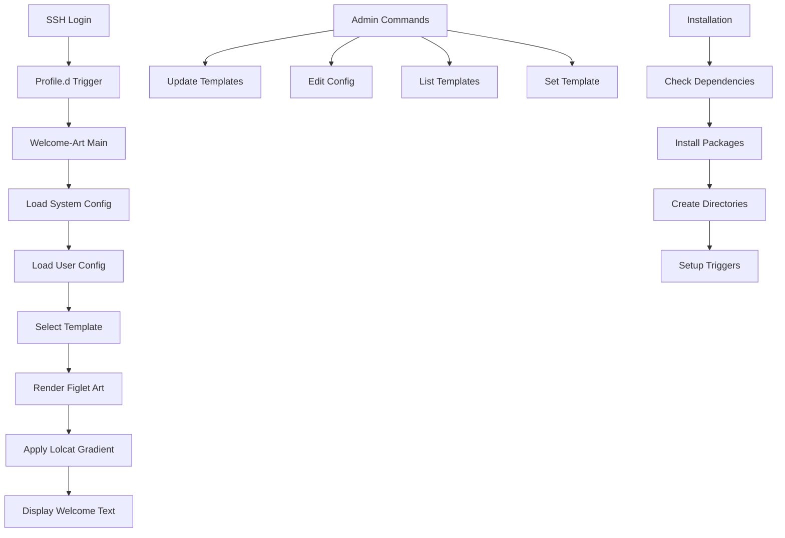

# Welcome-Art Package - Product Requirements Document

## 1. Product Overview
Welcome-Art is a modular bash script package for Ubuntu 18+ that displays dynamic figlet art with gradient effects and customizable text upon SSH/VPS login. The package provides a comprehensive solution for server administrators to create visually appealing login experiences with configurable art templates, smooth color gradients, and automated deployment capabilities.

## 2. Core Features

### 2.1 User Roles
| Role | Registration Method | Core Permissions |
|------|---------------------|------------------|
| System Administrator | Root access installation | Full configuration access, system-wide settings, package management |
| Regular User | User-level configuration | Personal customization via ~/.welcome-artrc, template selection |

### 2.2 Feature Module
Our welcome-art package consists of the following main components:
1. **Main Executable**: Core script with figlet rendering, gradient effects, and command-line interface.
2. **Art Template System**: Template storage, management, and selection interface.
3. **Auto-execution System**: Login triggers and integration scripts.
4. **Deployment Package**: Installation scripts, .deb package, and dependency management.

### 2.3 Page Details
| Component | Module Name | Feature Description |
|-----------|-------------|---------------------|
| Main Executable | Core Renderer | Render figlet art with lolcat gradients, accept CLI arguments, return proper exit codes |
| Main Executable | Text Display | Display configurable welcome text with color support |
| Art Templates | Template Storage | Directory structure at /etc/welcome-art/art/ for figlet template files |
| Art Templates | Template Management | Template selection, preview, and activation system |
| Auto-execution | System Trigger | Install login trigger in /etc/profile.d/welcome-art.sh |
| Auto-execution | User Integration | Support ~/.bashrc integration for user-level customization |
| Deployment | Package Creation | Create .deb package with proper dependencies and permissions |
| Deployment | Installation Scripts | Provide install.sh, quickinstall.sh, and quickuninstall.sh |
| Logging | System Logging | Comprehensive logging to /var/log/welcome-art.log with rotation |
| Dependencies | Package Management | Automatic figlet and lolcat installation and validation |

## 3. Core Process

**System Administrator Flow:**
1. Administrator runs quickinstall.sh or installs .deb package
2. System checks and installs dependencies (figlet, lolcat)
4. Sets up system-wide login trigger
5. Administrator can use subcommands to manage templates and configuration

**Regular User Flow:**
1. User logs in via SSH and welcome art displays automatically
2. User can create ~/.welcome-artrc for personal customization
3. User can run welcome-art commands to list and set personal templates
4. User can view available templates and previews

## 4. User Interface Design

### 4.1 Design Style
- **Primary Colors**: Dynamic gradient colors via lolcat (rainbow spectrum)
- **Secondary Colors**: Standard terminal colors for text and prompts
- **Art Style**: ASCII figlet fonts with smooth color transitions
- **Layout Style**: Terminal-based interface with clear command structure
- **Animation**: Smooth color gradient effects, no blinking or rapid changes
- **Typography**: Monospace terminal fonts, configurable figlet font selection

### 4.2 Component Design Overview
| Component | Module Name | UI Elements |
|-----------|-------------|-------------|
| Main Display | Art Renderer | Large figlet text with rainbow gradient, centered layout, smooth color transitions |
| Main Display | Welcome Text | Configurable text below art, standard terminal colors, left-aligned |
| Command Interface | Subcommands | Clean command-line interface, help text, error messages with color coding |
| Template List | Preview Display | Template names with mini previews, numbered list format, color-coded status |
| Configuration | Editor Interface | Standard text editor integration, syntax highlighting for config files |
| Installation | Progress Display | Clear progress indicators, dependency check results, success/error messages |

### 4.3 Responsiveness
The package is designed for terminal environments with full 256-color support. It adapts to different terminal widths and provides fallback options for limited color terminals. No touch interaction is required as this is a server-side terminal application.