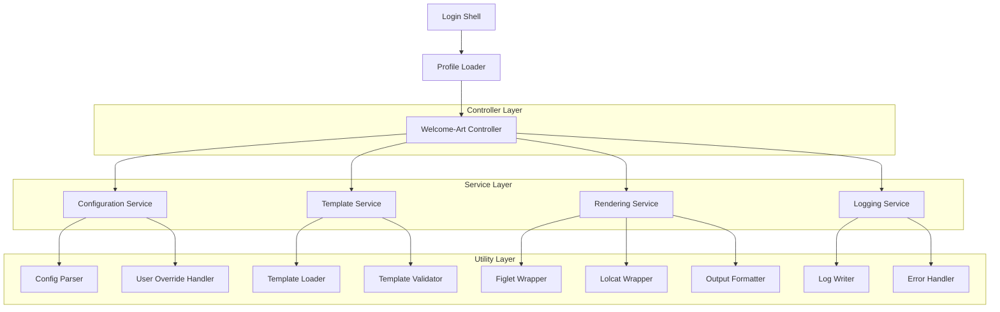

# Welcome-Art Package - Technical Architecture Document

## 1. Architecture Design

```mermaid
graph TD
    A[SSH Login] --> B[/etc/profile.d/welcome-art.sh]
    B --> C[/usr/local/bin/welcome-art]
    C --> D[Configuration Loader]
    C --> E[Template Manager]
    C --> F[Art Renderer]
    
    D --> G[/etc/welcome-art/config]
    D --> H[~/.welcome-artrc]
    
    E --> I[/etc/welcome-art/art/]
    E --> J[/etc/welcome-art/scripts/]
    
    F --> K[Figlet Engine]
    F --> L[Lolcat Processor]
    
    M[Package Manager] --> N[Dependencies]
    N --> O[figlet]
    N --> P[lolcat]
    
    Q[Logging System] --> R[/var/log/welcome-art.log]
    
    subgraph "Core System"
        C
        D
        E
        F
    end
    
    subgraph "Configuration Layer"
        G
        H
    end
    
    subgraph "Storage Layer"
        I
        J
        R
    end
    
    subgraph "External Dependencies"
        O
        P
    end
```

## 2. Technology Description

* **Core Language**: Bash scripting (compatible with Ubuntu 18+)

* **Art Rendering**: figlet (ASCII art generation) + lolcat (gradient coloring)

* **Package Management**: dpkg/apt for .deb packages, manual installation scripts

* **Logging**: Standard Unix logging with logrotate integration

* **Configuration**: INI-style configuration files with bash parsing

## 3. File Structure Definitions

| Path                          | Purpose                                        |
| ----------------------------- | ---------------------------------------------- |
| /usr/local/bin/welcome-art    | Main executable script with subcommand routing |
| /etc/welcome-art/config       | System-wide configuration file                 |
| /etc/welcome-art/art/         | Directory containing figlet template files     |
| /etc/welcome-art/scripts/     | Subcommand implementation modules              |
| \~/.welcome-artrc             | User-specific configuration overrides          |
| /etc/profile.d/welcome-art.sh | System-wide login trigger script               |
| /var/log/welcome-art.log      | Application log file with rotation             |

## 4. API Definitions

### 4.1 Core Commands

**Main Command**

```bash
welcome-art [OPTIONS] [SUBCOMMAND]
```

| Parameter  | Type   | Required | Description              |
| ---------- | ------ | -------- | ------------------------ |
| --template | string | false    | Specify template to use  |
| --text     | string | false    | Custom welcome text      |
| --no-color | flag   | false    | Disable color output     |
| --quiet    | flag   | false    | Suppress output          |
| --help     | flag   | false    | Display help information |

**Subcommands**

```bash
welcome-art update
```

Downloads latest art templates from repository

```bash
welcome-art config [--user|--system]
```

Launches editor for configuration modification

```bash
welcome-art list [--preview]
```

Displays available templates with optional previews

```bash
welcome-art set <template-name>
```

Activates specified art template

### 4.2 Exit Codes

| Code | Description          |
| ---- | -------------------- |
| 0    | Success              |
| 1    | General error        |
| 2    | Missing dependencies |
| 3    | Configuration error  |
| 4    | Template not found   |
| 5    | Permission denied    |

## 5. Server Architecture Diagram



## 6. Data Model

### 6.1 Configuration Structure

**System Configuration (/etc/welcome-art/config)**

```ini
[display]
default_template=default
welcome_text="Welcome to the server!"
color_enabled=true
animation_speed=medium

[templates]
repository_url=https://github.com/welcome-art/templates
auto_update=false
update_interval=weekly

[logging]
log_level=info
log_rotation=daily
max_log_size=10M

[system]
require_256_color=true
fallback_mode=simple
timeout=5
```

**User Configuration (\~/.welcome-artrc)**

```ini
[display]
template=custom
welcome_text="Welcome back, $USER!"
color_enabled=true

[personal]
show_system_info=true
show_last_login=false
custom_message="Have a great day!"
```

### 6.2 Template Structure

**Template File Format (.art)**

```ini
[metadata]
name=Modern
author=Welcome-Art Team
version=1.0
description=Modern geometric design

[figlet]
font=slant
width=80
alignment=center

[colors]
style=rainbow
speed=medium
reverse=false

[text]
content={{HOSTNAME}}
prefix=""
suffix=""
```

## 7. Deployment Architecture

### 7.1 Package Structure

```
welcome-art-package/
├── DEBIAN/
│   ├── control
│   ├── postinst
│   ├── prerm
│   └── postrm
├── usr/local/bin/
│   └── welcome-art
├── etc/welcome-art/
│   ├── config
│   ├── art/
│   │   ├── default.art
│   │   ├── modern.art
│   │   └── classic.art
│   └── scripts/
│       ├── update.sh
│       ├── config.sh
│       ├── list.sh
│       └── set.sh
├── etc/profile.d/
│   └── welcome-art.sh
└── var/log/
    └── welcome-art.log
```

### 7.2 Installation Scripts

**quickinstall.sh Features:**

* Dependency detection and installation

* User permission validation

* Automatic configuration setup

* Service registration

* Rollback on failure

**quickuninstall.sh Features:**

* Complete package removal

* Configuration backup

* Dependency cleanup (optional)

* System state restoration

* User data preservation option

### 7.3 Dependency Management

**Required Packages:**

* figlet (>= 2.2.5)

* lolcat (>= 100.0.0)

* bash (>= 4.0)

* coreutils

**Optional Packages:**

* toilet (alternative to figlet)

* cowsay (additional art options)

* fortune (dynamic text generation)

### 7.4 Security Considerations

* All scripts run with user permissions

* Configuration files have restricted permissions (644)

* Log files are readable by admin group only

* No network access required for core functionality

* Template validation prevents code injection

* Input sanitization for all user-provided content

